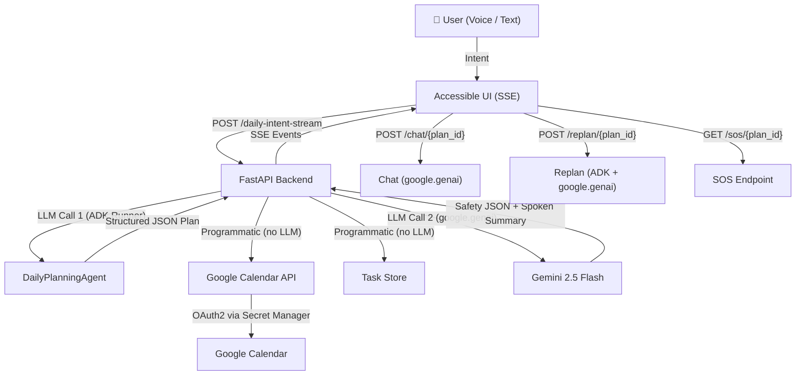

# 🌅 Guidelight AI v2.0

**An AI Daily Independence Copilot for Visually Impaired Users**

Guidelight AI is a multi-agent system built with **Google ADK** and **Gemini 2.5 Flash** on **Vertex AI** that plans, coordinates, monitors, and protects the daily routines of visually impaired users — using natural language or voice input.

> _"Help me plan my day. I have a doctor's appointment at 2pm, need medication reminders, want time to prepare meals, and need breaks between activities."_

The system generates a structured daily plan, syncs events to Google Calendar, creates trackable tasks, runs a safety assessment, and delivers a warm, spoken-friendly summary — all in **2 LLM calls** (~15 seconds) with real-time streaming feedback.

**Live Demo:** [https://guidelight-ai-669449334512.us-central1.run.app](https://guidelight-ai-669449334512.us-central1.run.app)

---

## Key Features

### Core Pipeline
- **Multi-Agent Pipeline** — 5 specialized ADK agents (Planner, Calendar, Tasks, Safety, Coordinator) orchestrated sequentially
- **Vertex AI + Gemini 2.5 Flash** — Production-grade LLM via Google Cloud with ADC authentication
- **MCP Tool Integration** — Calendar and Task Store follow the Model Context Protocol interface
- **Safety-First Design** — Detects overloaded schedules, missed medications, risky transitions, and cognitive overload
- **Optimized for Rate Limits** — Only 2 LLM calls per plan (down from 5); calendar/tasks populated programmatically

### v2.0: Advanced Features
- **Real Google Calendar Sync** — Events are created in the user's actual Google Calendar via OAuth2 (with in-memory fallback). Credentials stored securely via Google Secret Manager on Cloud Run.
- **Real-time SSE Streaming** — Watch each agent step complete in real-time via Server-Sent Events
- **Conversational Follow-up Chat** — Ask "What's next?", "Am I on track?", "Skip my 3pm task" after plan creation
- **Adaptive Mid-day Replanning** — Say "I'm running 30 minutes late" and the AI restructures your remaining day
- **Emergency SOS** — One-tap panic button generates shareable context for caregivers (current activity, medication status, overdue items)
- **Performance Metrics** — Live display of pipeline execution time, LLM calls, GCal sync status, and event count
- **Prominent Safety Alerts** — Risk assessment banner displayed above results, not buried in a tab

### Accessibility & UX
- **Voice Input & TTS** — Speak your plan via Web Speech API; all responses are automatically read aloud
- **Interactive Task Checklist** — Mark tasks as complete with a live progress bar
- **Quick Scenarios** — 6 one-click demo scenarios tailored for visually impaired users
- **WCAG 2.1 AA Accessible UI** — Keyboard-navigable, screen-reader friendly, high contrast dark theme, skip links
- **Tabbed Results** — Schedule, Tasks, Safety, and Chat panels in a compact tabbed layout

---

## System Architecture



### Dual LLM Strategy

| Call | Technology | Purpose |
|------|-----------|---------|
| **LLM Call 1** | Google ADK Runner | DailyPlanningAgent generates structured JSON plan with function calling |
| **LLM Call 2** | `google.genai.Client` (direct) | Safety evaluation + spoken summary — bypasses ADK Runner for speed and to avoid tool leakage |
| **Chat / Replan** | `google.genai.Client` (direct) | Follow-up conversations and replanning use direct Gemini API for reliability |

> **Why two LLM strategies?** ADK Runner is great for structured agent workflows with tool calling, but its shared `InMemorySessionService` can leak tool awareness across agents. For pure text generation (summary, chat, replan), calling Gemini directly via `google.genai.Client` is faster and avoids unintended tool invocations.

### Technology Stack

| Component | Technology | Why |
|-----------|-----------|-----|
| Model | Gemini 2.5 Flash | Fast, supports function calling + structured output via Vertex AI |
| Platform | Vertex AI | Enterprise-grade, ADC authentication, Cloud Run compatible |
| Agent Framework | Google ADK | Native multi-agent orchestration with function calling |
| Direct LLM | `google.genai.Client` | Lightweight Gemini calls for summary/chat/replan without ADK overhead |
| Tool Interface | MCP (Model Context Protocol) | Standardized tool interfaces for Calendar & Task Store |
| Calendar | Google Calendar API (OAuth2) | Real calendar sync; credentials via Secret Manager on Cloud Run |
| Backend | FastAPI | Async API, SSE streaming, auto-generated docs |
| Streaming | SSE (Server-Sent Events) | Real-time pipeline progress without WebSocket complexity |
| Frontend | Vanilla HTML/CSS/JS | No build step, accessible, ~1500 lines |
| Runtime | Google Cloud Run | Serverless, auto-scaling, pay-per-use |
| Secrets | Google Secret Manager | OAuth token + credentials mounted as files in Cloud Run |

---

## Agent Tree

| # | Agent | Model | Role in Pipeline |
|---|-------|-------|-----------------|
| 1 | **DailyPlanningAgent** | gemini-2.5-flash | Converts natural-language intent into structured JSON daily plan; handles replanning |
| 2 | **CalendarAndReminderAgent** | gemini-2.5-flash | Schedules events via Google Calendar API (called programmatically, not via LLM) |
| 3 | **TaskTrackingAgent** | gemini-2.5-flash | Creates trackable tasks via MCP Task Store (called programmatically) |
| 4 | **SafetyAndRiskAgent** | gemini-2.5-flash | Evaluates plan for overload, missed essentials, risky transitions |
| 5 | **IndependenceCoordinatorAgent** | gemini-2.5-flash | Root orchestrator with all sub-agents (available for complex delegation) |

> **Optimization:** Agents 2 & 3 are called programmatically (no LLM) since the structured JSON from Agent 1 provides all the data needed. Safety + Summary are combined into a single direct Gemini call. Total: **2 LLM calls per plan**.

---

## API Endpoints

| Method | Path | Description |
|--------|------|-------------|
| `POST` | `/daily-intent` | Submit natural-language intent, runs full agent pipeline |
| `POST` | `/daily-intent-stream` | SSE streaming pipeline with real-time step updates |
| `GET` | `/daily-plan/{plan_id}` | Retrieve the complete plan with structured data |
| `GET` | `/daily-status/{plan_id}` | Get task-tracking progress for a plan |
| `POST` | `/complete-task/{plan_id}/{task_id}` | Mark a task as completed |
| `POST` | `/chat/{plan_id}` | Conversational follow-up about your active plan |
| `POST` | `/replan/{plan_id}` | Adaptive replanning when circumstances change |
| `GET` | `/sos/{plan_id}` | Emergency context summary for caregivers |
| `GET` | `/health` | Production health check with performance metrics |
| `GET` | `/` | Accessible demo UI |

---

## Quick Start

### Prerequisites

- Python 3.11+
- Google Cloud project with Vertex AI API enabled
- (Optional) Google Calendar OAuth credentials for real calendar sync

### 1. Clone & install

```bash
cd guidelight-ai
python3 -m venv .venv
source .venv/bin/activate
pip install -r requirements.txt
```

### 2. Configure environment

```bash
cp .env.example .env
```

Required in `.env`:
```
GOOGLE_CLOUD_PROJECT=your-gcp-project-id
GOOGLE_CLOUD_LOCATION=us-central1
GOOGLE_GENAI_USE_VERTEXAI=TRUE
GEMINI_MODEL=gemini-2.5-flash
```

### 3. (Optional) Enable Google Calendar sync

```bash
# Place your OAuth desktop app credentials as credentials.json in the project root
# Then run the auth flow:
python3 tools/auth_calendar.py
# This creates token.json — events will sync to your real Google Calendar
```

### 4. Run locally

```bash
python3 -m uvicorn app:app --host 0.0.0.0 --port 8080 --reload
# → Open http://localhost:8080
```

### 5. Deploy to Cloud Run

```bash
export GOOGLE_CLOUD_PROJECT=your-project-id
export GOOGLE_CLOUD_LOCATION=us-central1
bash deploy.sh
```

The deploy script builds the Docker image, pushes to GCR, and deploys to Cloud Run with:
- Vertex AI environment variables
- Google Calendar OAuth credentials mounted via Secret Manager (`gcal-token`, `gcal-credentials`)

---

## Project Structure

```
guidelight-ai/
├── agents/
│   ├── __init__.py
│   ├── coordinator_agent.py     # IndependenceCoordinatorAgent (root orchestrator)
│   ├── daily_planning_agent.py  # DailyPlanningAgent (LLM Call 1)
│   ├── calendar_agent.py        # CalendarAndReminderAgent
│   ├── task_tracking_agent.py   # TaskTrackingAgent
│   ├── safety_agent.py          # SafetyAndRiskAgent
│   └── summary_agent.py         # SummaryAgent (standalone, legacy)
├── tools/
│   ├── __init__.py
│   ├── calendar_tool.py         # Google Calendar API + in-memory fallback
│   ├── task_store.py            # MCP-compliant task store
│   └── auth_calendar.py         # OAuth2 flow for Google Calendar
├── static/
│   └── index.html               # Accessible demo UI (~1500 lines, vanilla JS)
├── app.py                       # FastAPI backend (dual LLM strategy)
├── config.py                    # Centralized configuration
├── requirements.txt
├── Dockerfile
├── .dockerignore
├── .env.example
├── deploy.sh                    # Cloud Run deployment with Secret Manager
├── DEMO_SCRIPT.md               # 3-minute demo narration script
├── DEVPOST.md                   # Devpost submission text
└── README.md
```

---

## Demo Scenarios

Click any scenario card in the UI to instantly populate and run:

| Scenario | Description |
|----------|-------------|
| 🏥 **Medical Day** | Doctor visit, medication reminders, pharmacy call |
| ☕ **Social Day** | Coffee with friend, groceries, family call |
| 🏡 **Restful Day** | Home-focused, audio books, extra rest breaks |
| ⚡ **Busy Day** | Physiotherapy, work call, yoga, errands |
| 🦮 **Navigation Day** | Guide dog walk, mobility training, route practice |
| 🔊 **Assistive Tech Day** | Screen reader setup, braille display, voice assistant |

---

## Performance

| Metric | Value |
|--------|-------|
| LLM calls per plan | **2** |
| Pipeline execution time | **~15 seconds** |
| Token usage per plan | ~3K input |
| Google Calendar events synced | Real-time via OAuth2 |
| Streaming updates | Real-time SSE (step-by-step) |

---

## Accessibility

- Semantic HTML only (no frontend frameworks)
- WCAG 2.1 AA compliant high-contrast dark theme
- Large fonts (base 1.1rem, Inter)
- Full keyboard navigation with skip-to-content link
- ARIA labels, roles, and live regions throughout
- Screen-reader friendly spoken summaries
- Voice input via Web Speech API
- Auto text-to-speech for plan summaries
- Ctrl/Cmd+Enter keyboard shortcut to submit

---

## License

MIT
