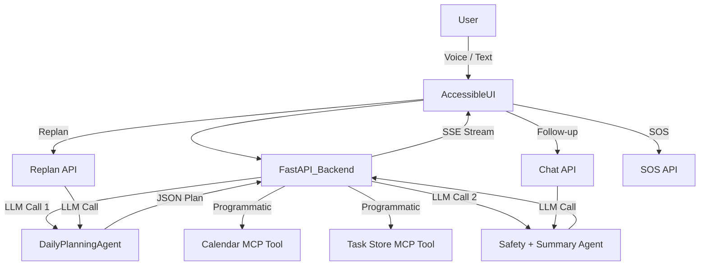

# 🌅 Guidelight AI v2.0

**An AI Daily Independence Copilot for Visually Impaired Users**

Guidelight AI is a multi-agent system built with **Google ADK** and **Gemini 2.5 Flash** on **Vertex AI** that plans, coordinates, monitors, and protects the daily routines of visually impaired users — using natural language or voice input.

> _"Help me plan my day. I have a doctor's appointment at 2pm, need medication reminders, want time to prepare meals, and need breaks between activities."_

The system generates a structured daily plan, populates a calendar, creates trackable tasks, runs a safety assessment, and delivers a warm, spoken-friendly summary — all in **2 LLM calls** with real-time streaming feedback.

---

## Key Features

### Core Pipeline
- **Multi-Agent Pipeline** — 5 specialized ADK agents (Planner, Calendar, Tasks, Safety, Coordinator) work in sequence
- **Vertex AI + Gemini 2.5 Flash** — Production-grade LLM via Google Cloud with ADC authentication
- **MCP Tool Integration** — Calendar and Task Store follow the Model Context Protocol interface
- **Safety-First Design** — Detects overloaded schedules, missed medications, risky transitions, and cognitive overload
- **Optimized for Rate Limits** — Only 2 LLM calls per plan (down from 5); calendar/tasks populated programmatically

### v2.0: Advanced Features
- **Real Google Calendar Sync** — Events are created in the user's actual Google Calendar via OAuth2 (with in-memory fallback)
- **Real-time SSE Streaming** — Watch each agent step complete in real-time via Server-Sent Events
- **Conversational Follow-up Chat** — Ask "What's next?", "Am I on track?", "Skip my 3pm task" after plan creation
- **Adaptive Mid-day Replanning** — Say "I'm running 30 minutes late" and the AI restructures your remaining day
- **Emergency SOS** — One-tap panic button generates shareable context for caregivers (current activity, medication status, overdue items)
- **Performance Metrics** — Live display of pipeline execution time, LLM calls, GCal sync status, and event count
- **Prominent Safety Alerts** — Risk assessment banner displayed above results, not buried in a tab

### Accessibility & UX
- **Voice Input & TTS** — Speak your plan via Web Speech API; all responses are automatically read aloud
- **Interactive Task Checklist** — Mark tasks as complete with a live progress bar
- **Quick Scenarios** — 6 one-click demo scenarios tailored for visually impaired users
- **WCAG 2.1 AA Accessible UI** — Keyboard-navigable, screen-reader friendly, high contrast, skip links
- **Tabbed Results** — Schedule, Tasks, Safety, and Chat panels in a compact tabbed layout

---

## System Architecture



**Key architectural decisions:**

| Component | Technology | Why |
|-----------|-----------|-----|
| Model | Gemini 2.5 Flash | High performance, supports function calling + thinking via Vertex AI |
| Platform | Vertex AI | Enterprise-grade, uses $100 hackathon credits, ADC authentication |
| Orchestration | Google ADK | Native multi-agent coordination with function calling |
| Tool Integration | MCP (Model Context Protocol) | Standardized tool interfaces for Calendar & Task Store |
| Calendar | Google Calendar API (OAuth2) | Real calendar sync with in-memory fallback |
| Backend | FastAPI (stateless) | Fast async API, auto-generated docs |
| Streaming | SSE (Server-Sent Events) | Real-time pipeline progress without WebSocket complexity |
| Runtime | Google Cloud Run | Serverless, auto-scaling, pay-per-use |
| State | In-memory (demo) / Firestore (prod) | Persistent workflow state across agent steps |

---

## Agent Tree

| # | Agent | Model | Responsibility |
|---|-------|-------|---------------|
| 1 | **IndependenceCoordinatorAgent** | gemini-2.5-flash | Root orchestrator – interprets intent, runs safety eval, produces final summary, handles follow-up chat |
| 2 | **DailyPlanningAgent** | gemini-2.5-flash | Converts natural-language intent into structured JSON daily plan; handles replanning |
| 3 | **CalendarAndReminderAgent** | gemini-2.5-flash | Schedules events & reminders via MCP Calendar (tools called programmatically) |
| 4 | **TaskTrackingAgent** | gemini-2.5-flash | Creates trackable tasks via MCP Task Store (tools called programmatically) |
| 5 | **SafetyAndRiskAgent** | gemini-2.5-flash | Evaluates plan for overload, missed essentials, risky transitions |

> **Optimization:** Agents 3 & 4 are called programmatically (no LLM) since the structured JSON from Agent 2 provides all the data needed. Agents 1 & 5 are combined into a single LLM call. Total: **2 LLM calls per plan**.

---

## API Endpoints

| Method | Path | Description |
|--------|------|-------------|
| `POST` | `/daily-intent` | Submit natural-language intent, runs full agent pipeline |
| `POST` | `/daily-intent-stream` | **NEW:** SSE streaming pipeline with real-time step updates |
| `GET` | `/daily-plan/{plan_id}` | Retrieve the complete plan with structured data |
| `GET` | `/daily-status/{plan_id}` | Get task-tracking progress for a plan |
| `POST` | `/complete-task/{plan_id}/{task_id}` | Mark a task as completed |
| `POST` | `/chat/{plan_id}` | **NEW:** Conversational follow-up about your active plan |
| `POST` | `/replan/{plan_id}` | **NEW:** Adaptive replanning when circumstances change |
| `GET` | `/sos/{plan_id}` | **NEW:** Emergency context summary for caregivers |
| `GET` | `/health` | **NEW:** Production health check with performance metrics |
| `GET` | `/` | Accessible demo UI |

---

## Quick Start

### Prerequisites

- Python 3.11+
- A Google API key with Gemini API enabled

### 1. Clone & install

```bash
cd guidelight-ai
python3 -m venv .venv
source .venv/bin/activate
pip install -r requirements.txt
```

### 2. Configure environment

```bash
cp .env.example .env
# Edit .env with your Google API key
```

Required in `.env`:
```
GOOGLE_API_KEY=your-api-key-here
GEMINI_MODEL=gemini-2.5-flash
```

### 3. Run locally

```bash
python3 -m uvicorn app:app --host 0.0.0.0 --port 8080 --reload
# → Open http://localhost:8080
```

### 4. Deploy to Cloud Run

```bash
export GOOGLE_CLOUD_PROJECT=your-project-id
export GOOGLE_CLOUD_LOCATION=us-central1
./deploy.sh
```

---

## Project Structure

```
guidelight-ai/
├── agents/
│   ├── __init__.py
│   ├── coordinator_agent.py     # IndependenceCoordinatorAgent (root)
│   ├── daily_planning_agent.py  # DailyPlanningAgent
│   ├── calendar_agent.py        # CalendarAndReminderAgent
│   ├── task_tracking_agent.py   # TaskTrackingAgent
│   └── safety_agent.py          # SafetyAndRiskAgent
├── tools/
│   ├── __init__.py
│   ├── calendar_tool.py         # MCP Google Calendar stub
│   └── task_store.py            # MCP persistent task store stub
├── static/
│   └── index.html               # Accessible demo UI (tabbed layout)
├── app.py                       # FastAPI backend (2-call optimized pipeline)
├── config.py                    # Centralized configuration
├── requirements.txt
├── Dockerfile
├── .dockerignore
├── .env.example
├── deploy.sh                    # Cloud Run deployment script
├── DEMO_SCRIPT.md               # Demo narration script
├── DEVPOST.md                   # Devpost submission text
└── README.md
```

---

## Demo Scenarios

Click any scenario card in the UI to instantly populate and run:

| Scenario | Description |
|----------|-------------|
| 🏥 **Medical Day** | Doctor visit, medication reminders, pharmacy call |
| ☕ **Social Day** | Coffee with friend, groceries, family call |
| 🏡 **Restful Day** | Home-focused, audio books, extra rest breaks |
| ⚡ **Busy Day** | Physiotherapy, work call, yoga, errands |
| 🦮 **Navigation Day** | Guide dog walk, mobility training, route practice |
| 🔊 **Assistive Tech Day** | Screen reader setup, braille display, voice assistant |

---

## Accessibility Features

- Semantic HTML only (no frameworks)
- WCAG-compliant high-contrast dark theme
- Large fonts (base 1.1rem, Inter)
- Full keyboard navigation with skip-to-content link
- ARIA labels, roles, and live regions throughout
- Screen-reader friendly spoken summaries
- Voice input via Web Speech API
- Auto text-to-speech for plan summaries
- Ctrl/Cmd+Enter keyboard shortcut

---

## Rate Limit Optimization

| Metric | Before | After |
|--------|--------|-------|
| LLM calls per plan | 5 | **2** |
| Token usage | ~8K input/plan | ~3K input/plan |
| Plans per day (free tier) | ~4 | **~10** |
| Model | gemini-2.5-flash | **gemini-3.1-flash-lite-preview** |

---

## License

MIT
